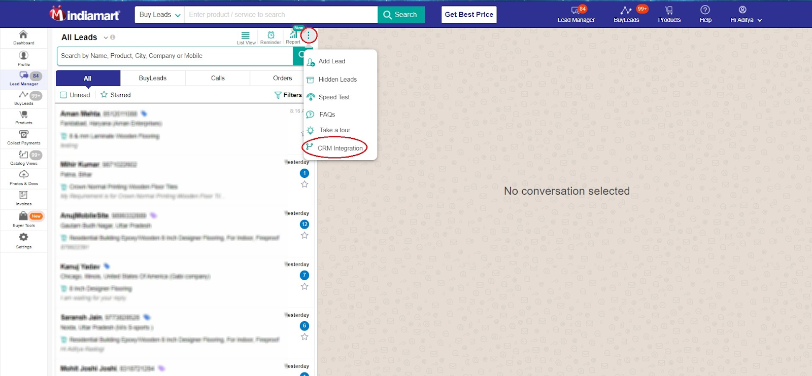

### Indiamart Erpnext Integration by GreyCube.in

[Indiamart CRM API(Lead)](https://help.indiamart.com/knowledge-base/lms-crm-integration/), integration with ERPNext by [GreyCube.in](https://greycube.in/) 🚀️

**What does the app do?**

* Indiamart.com : It is a market place where buyers come to fulfill their purchase requirements. i.e. they generate Leads
* ERPNext : It is open source ERP
* Indiamart Erpnext Integration (App): It automatically pulls purchase inquires from indiamart and creats lead in ERPNext. App is developed by [GreyCube.in](https://greycube.in/) (official and certified ERPNext service provider)

**Benefits**

* No Manual Entry/intervention required
* No Human Erorr
* Pulls all leads based on the time
* Don't miss out any potential leads
* Focus on lead conversion and not on lead data entry/handling
* Make full use of ERPNext CRM module
* As the lead gets generated automatically in ERPNext, you can serve your customers with no delay and do more business than competitors

**Features**

* Pull Leads from IndiaMart via API every 5 mins. Overlap is such that no lead is lost.
* Create Leads automatically in ERPNext
* Maps respective fields of IndiaMart with ERPNext Lead.👀️ 

* Auto creation of contacts/address in ERPNext
* Handle Duplicate/ Repeat Leads based on mobile_no/ email
* Automatically create Opportunity for repeat leads
* IndiaMart Integration Log maintained
* Facility to map indiamart provided Query Type in Inquiry to your Lead Source 
* Facility to manaully pull leads for specific time frame
* App workspace with all related links
  

* Connection dashboard at top of releated doctypes in ERPNext
* Receive Auto Notification incase of error during Lead Integration
* All [IndiaMart Integration Best Practices ](https://help.indiamart.com/knowledge-base/lms-crm-integration/)followed

**How to setup?**

1. Get mobile no and API Key from indiamart

* Mobile: This is the primary mobile number of your account registered with IndiaMART
* API Key : Go to seller.indiamart.com->Settings->Account Settings(tab)->Generate Key This is a unique API Key which is received on your primary email.

2. Enter all details in Indiamart Settings doctype. ex URL
   https://<yourdomain.com>/app/indiamart-settings
   

**[Contact us](https://greycube.in/contact) for customization**

* Automatic mapping of Territory based on IndiaMart Lead Origin
* Automatic mapping of Leads based on Territory Manager
* Automatic mapping of Leads based on Round Robin ALgorithm for multiple Sales person in a specific Territory
* Single dashboard view of lead response
* Integrate your sales team call data with lead

